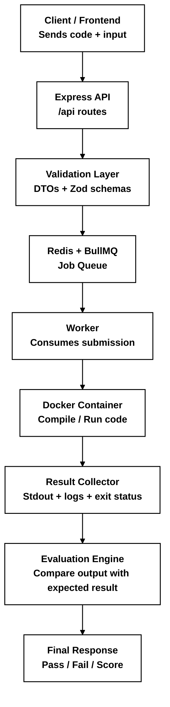

# CodeLadderArena Evaluator Service

This project is a backend evaluator service for a coding challenge or competitive programming platform. It receives user code submissions, puts them into a queue, executes them in isolated containers, and evaluates the result against test cases or custom validation logic.

In simple terms, the service acts as the engine behind a coding platform where users submit solutions in languages such as Python, Java, or C++, and the system checks whether those solutions work correctly.

## What this project does

- Accepts code submissions through a REST API
- Validates incoming request data using schemas
- Queues evaluation jobs for asynchronous processing
- Runs code inside isolated Docker containers
- Uses Redis + BullMQ for background job processing
- Monitors tasks through Bull Board UI
- Produces evaluation results that can be consumed by a frontend or another service

This makes the project suitable for:

- coding assessment platforms
- online judge-style systems
- automated code evaluation workflows
- challenge grading services

## Tech stack

- Node.js
- TypeScript
- Express.js
- Redis
- BullMQ
- Docker / Dockerode
- PostgreSQL-like concepts are not used directly in this repo, but the service is designed for structured evaluation workflows
- Jest and Supertest for testing
- Zod for request validation
- ESLint and Prettier for code quality

## Project structure

- `src/index.ts` – application entry point
- `src/routes` – API routes
- `src/controllers` – request handlers
- `src/queues` – queue definitions
- `src/producers` – producers that enqueue evaluation jobs
- `src/workers` – background job workers that process submissions
- `src/containers` – container-based execution logic
- `src/validator` and `src/dtos` – validation and request structure handling
- `src/config` – Redis, port, and app configuration

## Typical workflow

1. A client sends a code submission to the API.
2. The service validates the payload and DTO structure.
3. The submission is pushed into a job queue.
4. A worker picks the job and executes the user code in a container.
5. The result is captured (stdout, errors, exit status, etc.).
6. The service compares the output against expected behavior or test data.
7. The final result is returned or stored for further processing.

## Run locally

Install dependencies:

```bash
npm install
```

Run the app in development mode:

```bash
npm run dev
```

Or build and start:

```bash
npm run build
npm start
```

## How this service works



This is the core lifecycle: submit code → validate → enqueue → execute in a sandbox → collect output → evaluate → respond.

## Useful project notes

This repository also contains supporting documentation files:

- [zsetupTs.md](./zsetupTs.md) – TypeScript + Express project setup notes
- [z_info.md](./z_info.md) – additional project notes and learning references

## Notes

This service is focused on evaluation and execution workflows rather than a full user-facing application. It is a backend engine that can power a coding challenge platform, judge system, or assessment service.
